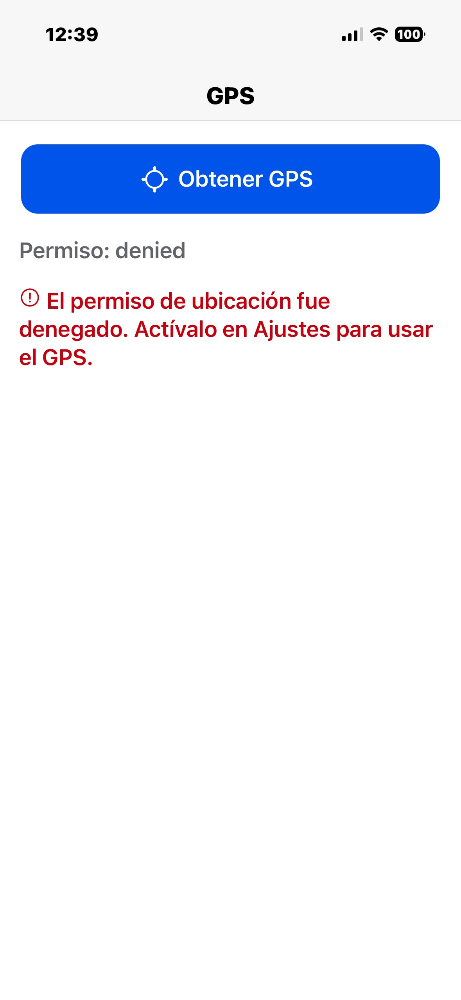
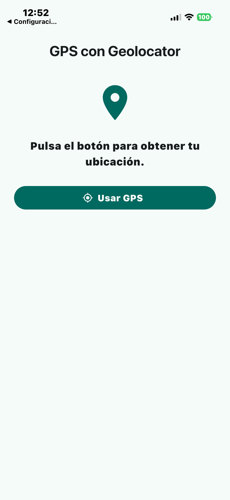
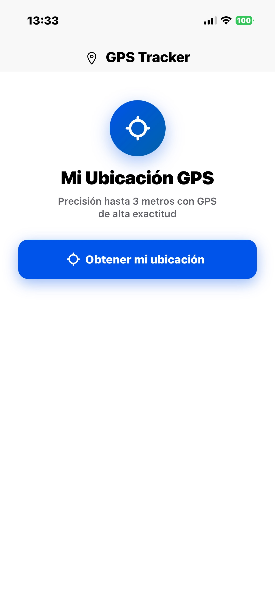
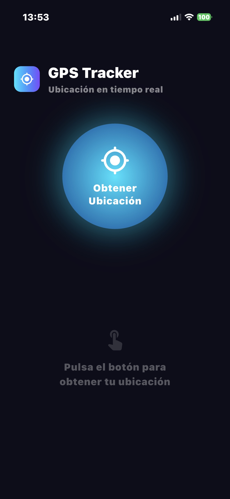

# 📱 Comparativa de Desarrollo Asistido por IA: GPS en Ionic vs Flutter

[](https://ionicframework.com/)
[](https://flutter.dev/)
[](https://openai.com/)
[](https://google.com/)

> **Deber de Inteligencia Artificial - ESFOT**
----
> **Estudiante:** Wilmer Ramos

### 🎥 Demostración Práctica
[👉 **MIRA EL VIDEO DEMOSTRATIVO (TIKTOK/REELS) AQUÍ** 👈]([Pega_aqui_el_link_de_tu_video])

---

## 🎯 Objetivo
Comparar la implementación del hardware de geolocalización (GPS) en frameworks multiplataforma (Ionic y Flutter), y analizar el desempeño, precisión y autonomía de las herramientas **OpenAI Codex** y **Google Antigravity** para el desarrollo de software asistido por Inteligencia Artificial.

---

## 📂 Estructura del Repositorio

El proyecto contiene 4 aplicaciones funcionales, divididas por la IA que las generó:

```text
📁 comparativa-gps-ia/
├── 📁 antigravity/
│   ├── 📁 flutter_gps/    (App Flutter creada por agente autónomo Antigravity)
│   └── 📁 ionic-gps/      (App Ionic creada por agente autónomo Antigravity)
├── 📁 codex/
│   ├── 📁 flutter_gps/    (App Flutter generada con alto razonamiento de Codex)
│   └── 📁 ionic-gps/      (App Ionic generada con alto razonamiento de Codex)
├── 📁 screenshots/        (Evidencias gráficas del funcionamiento y errores)
└── 📄 README.md
```
----

## 🛠️ Implementación Técnica y Manejo de Errores
Ambos desarrollos se compilaron y probaron nativamente en iOS utilizando Xcode en un entorno macOS (Apple Silicon M1).

Para garantizar la seguridad y evitar cierres inesperados (crashes) por políticas de privacidad de Apple, todas las aplicaciones incluyen:

### 1. Configuración Nativa: 
Implementación estricta de las llaves ```text NSLocationWhenInUseUsageDescription ```y ```text NSLocationAlwaysUsageDescription``` en el archivo ```text ios/Runner/Info.plist (Flutter)``` y ```text ios/App/Info.plist (Ionic)```.

### 2. Manejo de Excepciones en UI: 
Bloques ```text try/catch``` robustos que alertan al usuario visualmente si:

- El servicio de GPS del dispositivo está apagado.

- El usuario denegó los permisos de ubicación en el sistema.
----
## 1. Ecosistema Ionic (Angular + Capacitor)
### Librería: 
```text @capacitor/geolocation.```

### Proceso: 
Construcción web con ``` text npm run build ```y sincronización nativa mediante ```text npx cap sync ios```.

## 2. Ecosistema Flutter (Dart)
### Librería: 
```text geolocator``` (Añadido en pubspec.yaml).

### Proceso: 
Compilación directa mediante ```text flutter run``` hacia el dispositivo físico iOS / Simulador.

## Evidencia 

### Codex 

#### 1. Ionic GPS


---
#### 2. Flutter GPS


---

### Antigravity

#### 1. Ionic GPS


---
#### 2. Flutter GPS


---

## 🚀 Instrucciones de Ejecución Local
Para emular los proyectos en un entorno macOS con Xcode instalado:
``` text
# Clonar el repositorio
git clone https://github.com/WilmerRamos21/Comparativa-Apps-GPS-con-IA.git
cd comparativa-gps-ia

# Para ejecutar Flutter:
cd codex/flutter_gps
flutter pub get
flutter run

# Para ejecutar Ionic:
cd codex/ionic-gps
npm install
npm run build
npx cap sync ios
npx cap open ios # Ejecutar desde Xcode
```
